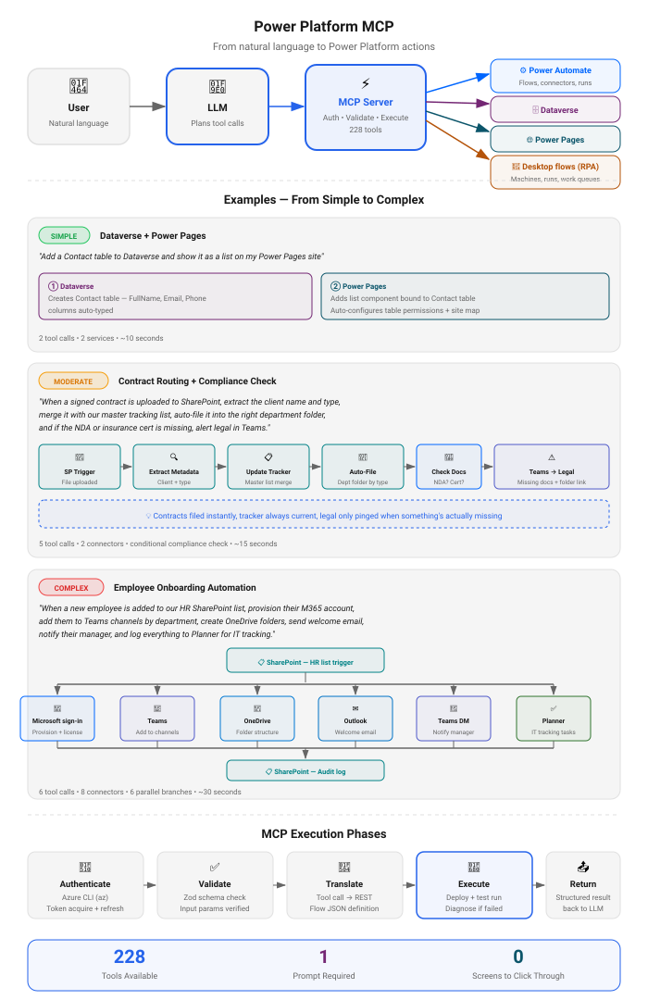

# Power Platform MCP Server

**216 tools for Microsoft Power Platform, authenticated by the Azure CLI — no app registration, no admin consent, no token cache.** Build, run, diagnose, and govern Power Automate flows, Dataverse, SharePoint, Power Apps, Power Pages, RPA, and tenant administration in natural language.

Works with any MCP-compatible AI client: **Claude Desktop**, **Claude Code**, **VS Code Copilot**, **Cursor**, **Google Gemini CLI**, and more.

```bash
npm install -g powerplatform-mcp-server   # 1. install
powerplatform-mcp-server --setup          # 2. sign in + connect your AI app
powerplatform-mcp-server --doctor         # 3. confirm everything works
```

| Where to go | What's there |
|------|------------------|
| **This page** | [Quick start](#quick-start) · [Authentication](#authentication-azure-cli) · [What it can do](#what-it-can-do) · [Security](#security) · [Architecture](#architecture) |
| [**All 216 tools**](https://github.com/rcb0727/powerplatform-mcp-server/blob/main/TOOLS.md) | The full reference, grouped, with every tool's description |
| [**Examples**](https://github.com/rcb0727/powerplatform-mcp-server/blob/main/EXAMPLES.md) | Real prompts to try, by area |
| [**Install guide**](https://github.com/rcb0727/powerplatform-mcp-server/blob/main/INSTALL.md) | Step-by-step setup, updating, CLI reference, reducing approval prompts, troubleshooting |
| [**Changelog**](https://github.com/rcb0727/powerplatform-mcp-server/blob/main/CHANGELOG.md) | Release history |
| [**Privacy**](https://github.com/rcb0727/powerplatform-mcp-server/blob/main/PRIVACY.md) | Collects nothing; data flows only to Microsoft under your account |
| [**Issues**](https://github.com/rcb0727/powerplatform-mcp-server/issues) | Bug reports and feature requests — every one gets read |

## Quick Start

The three commands at the top of this page are the whole install. The `--setup` wizard does it all: checks the Azure CLI (running `az login` if needed), picks your environment, **and wires the server into your AI app for you** — no hand-editing JSON. It ends by verifying the whole chain (config, Azure CLI session, live API) before declaring success. Then restart your app and ask it to build a flow.

Signed out later (expired token, MFA policy change)? `powerplatform-mcp-server --login` re-authenticates without re-running the wizard — or just ask your AI assistant to run the **`sign_in`** tool and finish the sign-in from chat, no terminal needed.

**Not very technical?** Follow the step-by-step **[Easy Path](https://github.com/rcb0727/powerplatform-mcp-server/blob/main/INSTALL.md#easy-path-3-steps)** with checkpoints.

| Want to… | Do this |
|----------|---------|
| Connect a specific app during setup | `powerplatform-mcp-server --setup --client claude` |
| Connect an app later (or a second one) | `powerplatform-mcp-server --client cursor` |
| Skip the global install | `npx -y powerplatform-mcp-server@latest --setup` (add `--npx` so your app uses npx too) |
| Configure your app by hand | [Manual client configs](https://github.com/rcb0727/powerplatform-mcp-server/blob/main/INSTALL.md#connect-your-ai-app-manually) |

Supported apps: **Claude Desktop**, **Claude Code**, **Cursor**, **VS Code (Copilot)**, **Gemini CLI**, **Windsurf**, **ChatGPT** (via `--http`).

---

## Authentication (Azure CLI)

This server authenticates entirely through the **Azure CLI** — there is no Microsoft Entra app registration, no admin consent URL, and no token cache owned by this server. Tokens come from `az account get-access-token`, riding the CLI's own signed-in session.

### What you need

| Requirement | How |
|------|--------|
| Azure CLI installed | macOS: `brew install azure-cli` · Windows: `winget install Microsoft.AzureCLI` · Linux: [aka.ms/azure-cli](https://aka.ms/azure-cli) |
| A signed-in session | `az login` (the setup wizard runs it for you if needed) |

That's the entire auth story. If a tool ever reports missing credentials, the fix is `az login` — or ask your AI assistant to run the `sign_in` tool, which relays az's device-code sign-in into the chat.

### Notes for admins

- **Identity**: every call runs as the signed-in user, under the Azure CLI's first-party Microsoft client. Nothing new appears in your app registrations.
- **Consent**: most tenants already permit the Azure CLI. If yours restricts it, the block appears in Entra sign-in logs against *Microsoft Azure CLI* (Enterprise applications), and Conditional Access policies apply to it like any other client.
- **Revocation**: `az logout`, session revocation, or disabling the user works immediately — there is no separate grant to clean up.

## What it can do

**216 tools, 22 groups — everything at a glance** (full list with descriptions: [TOOLS.md](https://github.com/rcb0727/powerplatform-mcp-server/blob/main/TOOLS.md)):

<!-- TOOLS-GRID:BEGIN — generated by `npm run docs:tools`, do not edit by hand -->
| | | |
|---|---|---|
| **Setup & Authentication** (1) | **Core Flow Operations** (15) | **Testing & Debugging** (10) |
| **Planning & Help** (5) | **Connections & Custom Connectors** (13) | **Approvals** (3) |
| **Dataverse CRUD** (7) | **SharePoint** (11) | **Excel (OneDrive)** (2) |
| **Power Apps** (12) | **Canvas App Authoring (Preview)** (13) | **Model-driven Apps** (13) |
| **Power Apps Administration** (4) | **Power Pages — Site Configuration** (9) | **Power Pages — Site Management** (36) |
| **Power Pages — PAC CLI** (8) | **Environment Administration** (10) | **DLP Policies** (6) |
| **Solutions ALM** (8) | **Managed Environments & Capacity** (6) | **Desktop Flows / RPA** (13) |
| **Work Queues (RPA orchestration)** (8) | **Billing & AI Builder** (3) |  |
<!-- TOOLS-GRID:END -->


Beyond the tool count:

- **Natural-language flow building** — describe the automation; `plan_flow` gathers the specifics, `build_flow` creates it (even before its connections are configured), and pre-flight validation scores it against best practices (0–100)
- **Real diagnosis, not error dumps** — failed runs are drilled to the failing step with the actual API error and a proposed fix
- **Complete model-driven app lifecycle** — create AppModules, add or remove components, validate, publish, and manage security-role access through documented Dataverse operations
- **Canvas source authoring (preview)** — create and edit supported `.pa.yaml` source, discover live controls/APIs/data sources, synchronize from Studio, and compile back through Microsoft's official Canvas Authoring MCP server
- **Power Pages from content to hosting** — edit Dataverse configuration, provision and poll websites, manage domains/certificates/WAF/security, and run supported `pac pages` deployment workflows
- **Real Solution ALM** — asynchronous solution export/import, component add/remove, clone, and publish-all operations use documented Dataverse actions instead of placeholders
- **Sign in from the chat** — the `sign_in` tool completes Microsoft device-code auth without a terminal; every action runs under your own work account
- **Everything annotated** — all 216 tools declare read-only/destructive hints, so AI hosts can apply the right guardrails
- **Cross-platform** — Windows, macOS, and Linux

## Security

Defense-in-depth, hardened through 3 rounds of penetration testing:

- **Auth handled by the Azure CLI** — this server never sees credentials and never writes tokens to disk; tokens live in process memory only
- **SSRF prevention** — private-host detection across IPv4/IPv6, mapped/compat forms, octal/hex notation, link-local and ULA ranges
- **Injection protection** — OData tautology detection, Power Automate expression blocking, `execFile` over `exec`, prototype-pollution defense
- **Input validation** — GUIDs, field lists, environment IDs, SharePoint hostname allowlist; path-traversal and Unicode-normalization defenses
- **Sanitized output** — tokens/passwords/PII redacted from errors and logs (deep Pino redaction)
- **Resource limits** — bounded input sizes, JSON/binary response caps, depth limits
- **Hardened config & transport** — 0o600 config, symlink rejection, localhost-only HTTP binding with timing-safe auth

## Architecture

```
AI Client <--stdio/http--> powerplatform-mcp-server
(Claude, VS Code,               |
 Cursor, Gemini)                ├── Power Automate Flow Management API
                                ├── Power Apps API (canvas apps)
                                ├── Canvas Authoring MCP preview (.pa.yaml + live Studio coauthoring)
                                ├── Power Platform Admin API (environments, DLP, capacity)
                                ├── Power Platform API (Power Pages hosting and security)
                                ├── Microsoft Graph API (SharePoint, OneDrive, Excel)
                                ├── Dataverse Web API (tables, solutions, model-driven apps)
                                ├── PAC CLI (optional Power Pages workflows)
                                ├── Azure CLI auth (az account get-access-token)
                                └── SQLite Schema Cache (400+ connectors)
```



## License

[Free Use License 1.0](LICENSE) — free of charge to install and use, including at work. Selling, redistributing, modifying, or otherwise monetizing the software is not permitted. Versions published before this change remain MIT.

## Support

For issues and feature requests, [open an issue](https://github.com/rcb0727/powerplatform-mcp-server/issues) — every one gets read, and a solid reproduction gets a fast fix. Upgrading? See [Updating safely](https://github.com/rcb0727/powerplatform-mcp-server/blob/main/INSTALL.md#updating) and the [Changelog](https://github.com/rcb0727/powerplatform-mcp-server/blob/main/CHANGELOG.md).
